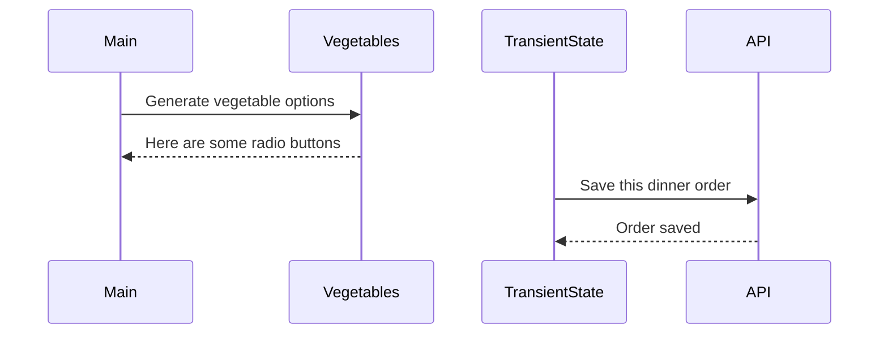

# Events and State Self-Assessment

> 🧨 Make sure you answer the vocabulary and understanding questions at the end of this document before notifying your coaches that you are done with the project

## Setup

1. Make sure you are in your `workspace` directory
1. `git clone {github repo SSH string}`
1. `cd` into the directory it creates
1. `code .` to open the project code
1. Use the `serve` command to start the web server
1. Open the URL provided in Chrome

## Requirements

### Initial Render

1. All 10 base dishes should be displayed as radio input options.
1. All 9 vegetables should be displayed as radio input options.
1. All 6 side dishes should be displayed as radio input options.
1. All previously purchases meals should be displayed below the meal options. Each purchase should display the primary key and the total cost of the purcahsed meal.

### State Management

1. When the user selects an item in any of the three columns, the choice should be stored as transient state.
1. When a user makes a choice for all three kinds of food, and then clicks the "Purchase Combo" button, a new sales object should be...
    1. Stored as permanent state in your local API.
    1. Represented as HTML below the **Monthly Sales** header in the following format **_exactly_**. Your output will not have zeroes, but the actual amount.
        ```html
        Receipt #1 = $00.00
        ```
   1. The user's choices should be cleared from transient state once the purchase is made.

## Design

Given the description and animation above...

1. Create an ERD for this application before you begin.
1. Make a list of what modules need to be created to make your application as modular as possible. Create a **Dependency Graph** for the project to be reviewed once you are complete with the assessment.
1. Create a **Sequence Diagram** that visualizes what your algorithm is for this project. We'll give you a minimal starting point.



## Vocabulary and Understanding

> 🧨 Before you click the "Assessment Complete" button on the Learning Platform, add your answers below for each question and make a commit. It is your option to request a face-to-face meeting with a coach for a vocabulary review.

1. Should transient state be represented in a database diagram? Why, or why not?
   > Your answer here: No, it should not be represented in a database diagram, such as the ERD, because it's a temporary set of data, and that kind of data is not useful to show in an ERD. However, in something like a sequenceDiagram, or a dependencyGraph, it seems more useful to represent the transientData(module) only because it is a module with functions that affect other modules. 

2. In the **FoodTruck** module, you are **await**ing the invocation of all of the component functions _(e.g. sales, veggie options, etc.)_. Why must you use the `await` keyword there? Explain what happens if you remove it.
   > Your answer here: It is necessary to 'await' these function calls because these functions are returning promises made by the serve in other modules. As each function is called, the promise must first get resolved to retrieve the value of the function before moving on to the next invocation. If I removed the 'await' on these functions, the functions would be called asynchronically (or asynchronistically?), and would most likely lead the construction of the HTML most likely with promises not yet resolved in their respective functions, or rather the server would not have resolved the promise before the value of the function is returned.  

3. When the user is making choices by selecting radio buttons, explain how that data is retained so that the **Purchase Combo** button works correctly.
   > Your answer here: The radio button selected choices are stored within the transientState. There are setters for each HTML string that contains the radio buttons, and when a user selects one of those radio buttons, that choice is put into the transientState as a specific Id number, specifically it is stored in this part of the placeOrder function body: JSON.stringify(transientState). That transientState is strung together and submitted when the button is clicked. This is represented by the newSubmissionEvent variable as the button is clicked and activated in the DOM. That strung-together transientState is then Posted to the API. 

4. You used the `map()` array method in the self assessment _(at least, you should have since it is a learning objective)_. Explain why that function is helpful as a replacement for a `for..of` loop.
   > Your answer here: using .map array method is more useful here than a ForLoop because it's turning one array into another array, the latter containing far more specific and useful properties necessary for use in the function. If I used a ForLoop, I'd be accessing more properties which could lead to potential errors. I also do not have to declare an empty array as I would with a ForLoop and push new objects and properties into the array just to return it. It skips a lot of unnecessary steps and it looks a lot cleaner as well. 
