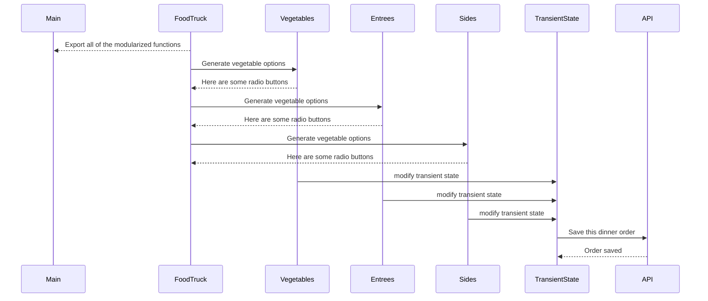

```mermaid
sequenceDiagram
    participant Main
    FoodTruck-->>Main: Export all of the modularized functions


    FoodTruck->>Vegetables: Generate vegetable options
    Vegetables-->>FoodTruck: Here are some radio buttons
    participant Vegetables
    FoodTruck->>Entrees: Generate vegetable options
    Entrees-->>FoodTruck: Here are some radio buttons
    participant Entrees
    FoodTruck->>Sides: Generate vegetable options
    Sides-->>FoodTruck: Here are some radio buttons
    participant Sides

Vegetables ->> TransientState: modify transient state
Entrees ->> TransientState: modify transient state
Sides ->> TransientState: modify transient state

    participant TransientState
    TransientState->>API: Save this dinner order
   
    API-->>TransientState: Order saved
    participant API
```